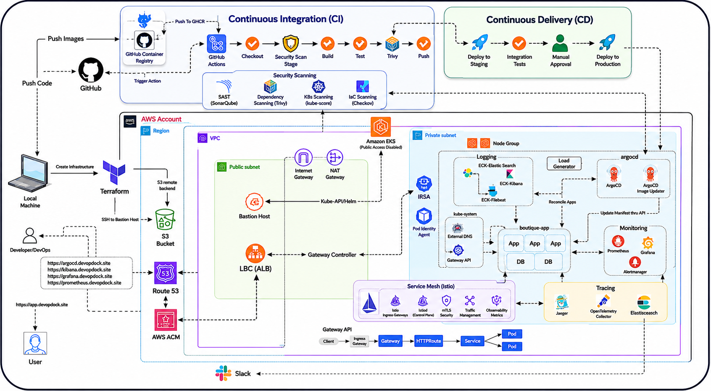

# 🚀 GitOps-Based End-to-End DevOps Platform on AWS EKS

---

# 📌 Project Overview

This project demonstrates a **production-grade GitOps-driven Kubernetes platform** deployed on **Amazon EKS (Elastic Kubernetes Service)** using modern DevOps and Cloud-Native tools.

The architecture implements a complete **CI/CD pipeline**, infrastructure automation, monitoring, logging,tracing, security integration, and automated application delivery using GitOps principles.

The platform is designed to achieve:

- Automated Infrastructure Provisioning
- Continuous Integration & Continuous Delivery
- Secure Kubernetes Deployments
- Service Mesh (Istio)
- Centralized Logging & Monitoring
- Scalability & High Availability
- Automated DNS & SSL Management
- Cloud-Native Observability
- Production-Ready Kubernetes Operations

---
# Project Architecture


---

# 🏗️ Project Description

The platform starts with developers pushing code to GitHub repositories.  
GitHub Actions automatically triggers the CI pipeline to:

1. Checkout application source code
2. Build Docker images
3. Scan images using Trivy
4. Push images to GitHub Container Registry (GHCR)

Infrastructure provisioning is fully automated using Terraform, which creates:

- AWS VPC
- Public & Private Subnets
- Internet Gateway & NAT Gateway
- Amazon EKS Cluster
- Bastion Host
- Route53 DNS
- ACM SSL Certificates
- S3 Remote Backend

The Kubernetes platform runs entirely inside private subnets for enhanced security.

GitOps-based Continuous Delivery is implemented using ArgoCD.  
ArgoCD continuously monitors Kubernetes manifests and automatically syncs deployments into the EKS cluster.

The platform also includes:

## 🌐 Service Mesh (Istio)

- Control & Manage Communication of MicroServices 
- security
- Traffic Spliting
- Circuit Breaking
- retries,timeout
- autothorization-policy 
- Obeservibility

## 🔍 Monitoring Stack

- Prometheus
- Grafana
- AlertManager

Used for:

- Metrics collection
- Visualization dashboards
- Cluster health monitoring
- Slack alerting integration

---

## 📜 Centralized Logging Stack (EFK)

The architecture implements the EFK stack:

- Elasticsearch
- FluentBit
- Kibana

Used for:

- Kubernetes log aggregation
- Centralized log analysis
- Real-time troubleshooting
- Application observability

---
## 🔍 Tracing

- Jaeger
- elastick search
- opentelementry 

## 🌐 Networking & Traffic Management

Traffic routing is managed using:

- AWS Load Balancer Controller (ALB)
- Kubernetes Gateway API
- ExternalDNS
- Route53

This enables:

- Automatic DNS management
- HTTPS traffic routing
- Dynamic ingress provisioning
- SSL certificate automation

---

# 🛠️ Tech Stack

## ☁️ Cloud Platform
- AWS (Amazon Web Services)

## 🏗️ Infrastructure as Code
- Terraform

## ☸️ Container Orchestration
- Kubernetes
- Amazon EKS

## 🔄 CI/CD & GitOps
- GitHub Actions
- ArgoCD
- GitHub Container Registry (GHCR)

## 🐳 Containerization
- Docker

---
## 🌐 Service Mesh (Istio)
---

## 🔐 Security
- Trivy
- IRSA (IAM Roles for Service Accounts)

## 🌐 Networking & DNS
- AWS ALB Controller
- Gateway API
- ExternalDNS
- Route53
- ACM (AWS Certificate Manager)

---

## 📊 Monitoring & Alerting
- Prometheus
- Grafana
- AlertManager
- Slack Integration

---

## 📜 Logging
- Elasticsearch
- FluentBit
- Kibana

---

## 💾 Storage & Backend
- Amazon S3 (Terraform Remote Backend)

---

## 🧰 DevOps Tools
- kubectl
- Helm
- Git
- Bash
---
# Intro to Online Boutique App

This is a type of e-commerce platform, but unlike Amazon-type stores, it focuses on:

- **Niche or curated products**
- **Unique / limited collections**
- **Strong brand identity & style**

Think of it as a **digital version of a small, stylish fashion store**.

But from a **technical perspective**, modern boutique apps are **not built as a single application**.

They are built using **Microservices Architecture**.

> [!TIP]
># What is Microservices?
>
>**Microservices** is an architectural style where an application is broken into **small, independent services**, and each service:
>
>- Handles a **specific business function**
>- Runs independently
>- Communicates via APIs
>
>👉 Instead of one big application (monolith), you have **multiple small services working together**.
>
>---
>
># Online Boutique = Microservices in Action
>
>This online boutique app is made up of multiple services like:
>
>### 🧾 Product Catalog Service
>
>- Manages product list, categories, pricing
>
>### 🛒 Cart Service
>
>- Handles user cart (add/remove items)
>
>### 💳 Payment Service
>
>- Processes payments (UPI, cards)
>
>### 📦 Order Service
>
>- Manages order lifecycle
>
>### 👤 Frontend Service
>
>- Authentication & profiles
>
>### 🚚 Shipping Service
>
>- Delivery tracking & logistics
>
>### Etc..
>
>---
>
># How These Services Communicate
>
>- REST APIs (HTTP)
>- gRPC (faster internal communication)
>- Message queues (Kafka / RabbitMQ)
>
>👉 Example:
>
>- Cart service → calls Product service
>- Order service → calls Payment service
>
>---
>
># Monolith vs Microservices
>
>### Monolithic App ❌
>
>- Everything in one codebase
>- Hard to scale
>- Single failure affects whole system
>
>### Microservices App ✅
>
>- Independent services
>- Easy to scale
>- Fault isolation
>
>👉 That’s why modern apps (like boutique apps) >use microservices.


# **Architecture**

**Online Boutique** is composed of 11 microservices written in different languages that talk to each other over gRPC.


| **Service** | **Language** | **Description** |
| --- | --- | --- |
| [frontend](https://github.com/Akashkayande/MicroServices-Deployment-EKS/blob/main/src/frontend) | Go | Exposes an HTTP server to serve the website. Does not require signup/login and generates session IDs for all users automatically. |
| [cartservice](https://github.com/Akashkayande/MicroServices-Deployment-EKS/blob/main/src/cartservice) | C# | Stores the items in the user's shopping cart in Redis and retrieves it. |
| [productcatalogservice](https://github.com/Akashkayande/MicroServices-Deployment-EKS/blob/main/src/productcatalogservice) | Go | Provides the list of products from a JSON file and ability to search products and get individual products. |
| [currencyservice](https://github.com/Akashkayande/MicroServices-Deployment-EKS/blob/main/src/currencyservice) | Node.js | Converts one money amount to another currency. Uses real values fetched from European Central Bank. It's the highest QPS service. |
| [paymentservice](https://github.com/Akashkayande/MicroServices-Deployment-EKS/blob/main/src/paymentservice) | Node.js | Charges the given credit card info (mock) with the given amount and returns a transaction ID. |
| [shippingservice](https://github.com/Akashkayande/MicroServices-Deployment-EKS/blob/main/src/shippingservice) | Go | Gives shipping cost estimates based on the shopping cart. Ships items to the given address (mock) |
| [emailservice](https://github.com/Akashkayande/MicroServices-Deployment-EKS/blob/main/src/emailservice) | Python | Sends users an order confirmation email (mock). |
| [checkoutservice](https://github.com/Akashkayande/MicroServices-Deployment-EKS/blob/main/src/checkoutservice) | Go | Retrieves user cart, prepares order and orchestrates the payment, shipping and the email notification. |
| [recommendationservice](https://github.com/Akashkayande/MicroServices-Deployment-EKS/blob/main/src/recommendationservice) | Python | Recommends other products based on what's given in the cart. |
| [adservice](https://github.com/Akashkayande/MicroServices-Deployment-EKS/blob/main/src/adservice) | Java | Provides text ads based on given context words. |
| [loadgenerator](https://github.com/Akashkayande/MicroServices-Deployment-EKS/blob/main/src/loadgenerator) | Python/Locust | Continuously sends requests imitating realistic user shopping flows to the frontend. |

Screenshots:


---

**Most services are stateless**, and **only the cart uses persistence (Redis)**. Let’s break it down cleanly.

# How data works in `microservices-demo`

This project is **designed** to:

- Demonstrate **microservice communication**
- Be **easy to deploy anywhere**
- Avoid complex database ops

So it uses **minimal persistence** on purpose.

---

## Service-by-Service Data Breakdown

### ✅ **cartservice** → ✔️ HAS persistence

**Storage used:**

- **Redis**

**What’s stored:**

- User cart items
- Quantity, product IDs

**Why Redis?**

- Fast
- Simple
- Easy to reset
- No schema complexity

📌 In Kubernetes:

- Redis runs as a pod (or StatefulSet)
- Cart data is lost if Redis is deleted (by default)

---

### ❌ **orders / checkout** → NO real database

There is **NO dedicated “orders database”**.

**checkoutservice:**

- Aggregates data from:
    - cartservice
    - paymentservice
    - shippingservice
    - emailservice
- Simulates order placement
- Does **not persist orders**

👉 This is **by design**, to keep the demo lightweight.

---
## SUMMARY TABLE

| Service | Persistent Storage | Type |
| --- | --- | --- |
| cartservice | ✅ Yes | Redis |
| checkoutservice | ❌ No | Stateless |
| productcatalogservice | ❌ No | In-memory JSON |
| recommendationservice | ❌ No | Stateless |
| paymentservice | ❌ No | Fake |
| shippingservice | ❌ No | Fake |
| emailservice | ❌ No | Fake |
| adservice | ❌ No | In-memory |
| frontend | ❌ No | Stateless |
| currencyservice | ❌ No | In-memory |
| loadgenerator | ❌ No | Stateless |

---

> “The demo intentionally keeps most services stateless to simplify deployment and focus on platform concerns like CI/CD, observability, scaling, and networking.”
> 

---

# Project Architecture


---
---
---
---
# Implementation

## Install tools in Local Machine

- AWS CLI
- Terraform in your local machine
- Create an IAM user and create access key and secret access key for the user and do `aws configure`

Clone the repo:

```bash
https://github.com/Akashkayande/MicroServices-Deployment-EKS.git
```

chnage directory to terraform:

```bash
cd Production-Grade_GitOps-Driven_Microservices-Demo/terraform/
```

## Terraform Run

Clone te repo , `cd` to `terraform` directory. Do

```bash
terraform init
Terraform plan 
```

Verify the resources and then do

```bash
terraform apply
```

After apply you should see the bastion host’s public IP as outputs.

At the current directory you would see the instance’s private key as well

## Set up Terraform Remote Backend (Optional)

Create a bucket using Console or AWS CLI.

```bash
aws s3api create-bucket \
  --bucket devopsdock-terraform-backend-bucket \
  --region us-east-1
```

Enable versioning and bucket encryption:

```bash
# Enable versioning
aws s3api put-bucket-versioning \
  --bucket devopsdock-terraform-backend-bucket \
  --versioning-configuration Status=Enabled

# Enable encryption
aws s3api put-bucket-encryption \
  --bucket devopsdock-terraform-backend-bucket \
  --server-side-encryption-configuration '{
    "Rules":[{
      "ApplyServerSideEncryptionByDefault":{
        "SSEAlgorithm":"AES256"
      }
    }]
  }'

```

Add this below backend block in `terraform.tf` file

```bash
terraform {
  backend "s3" {
    bucket = "devopsdock-terraform-backend-bucket"
    key    = "s3-backend"
    region = "us-east-1"
  }
}

```

Run `terraform init` to initialize it again.

As we already have the tfstate file locally you would see something similar , i.e move your state to backend.

Example Output:

```bash
 Initializing the backend...
Do you want to copy existing state to the new backend?
  Pre-existing state was found while migrating the previous "local" backend to the
  newly configured "s3" backend. No existing state was found in the newly
  configured "s3" backend. Do you want to copy this state to the new "s3"
  backend? Enter "yes" to copy and "no" to start with an empty state.

  Enter a value: 
```

Type “Yes”, The backend will move to s3.

Now the state will be reading from s3 backend.

## Bastion Host Configuration

SSH to the Bastion host from the same terraform directory as it creates the private key in the same directory.

```bash
ssh -i bastion-key.pem ubuntu@<publicIP>
```

Now install the below tools  in the Bastion Host:

- AWS CLI
- kubectl client
- HELM
- eksctl

**Installation Resource Docs**

- [https://docs.aws.amazon.com/cli/latest/userguide/getting-started-install.html](https://docs.aws.amazon.com/cli/latest/userguide/getting-started-install.html)
- [https://kubernetes.io/docs/tasks/tools/install-kubectl-linux/#install-using-native-package-management](https://kubernetes.io/docs/tasks/tools/install-kubectl-linux/#install-using-native-package-management)
- [https://helm.sh/docs/intro/install/](https://helm.sh/docs/intro/install/)
- [https://docs.aws.amazon.com/eks/latest/eksctl/installation.html](https://docs.aws.amazon.com/eks/latest/eksctl/installation.html)

Do `aws configure` and set up with the access and secret access keys , You can use the same access and secret access key which you set it up in the local.

Then, import the kubeconfig file by putting the below command.

```bash
aws eks update-kubeconfig --region <your-region> --name <your-cluster-name> 
```

After added the context check:

```bash
kubectl get nodes
```

Expected Output:

```bash
kubectl get nodes
NAME                         STATUS   ROLES    AGE    VERSION
ip-10-0-1-248.ec2.internal   Ready    <none>   100m   v1.33.5-eks-ecaa3a6
ip-10-0-2-138.ec2.internal   Ready    <none>   100m   v1.33.5-eks-ecaa3a6
```

## Install **AWS Load Balancer Controller**

Docs: [https://docs.aws.amazon.com/eks/latest/userguide/lbc-helm.html](https://docs.aws.amazon.com/eks/latest/userguide/lbc-helm.html)

[https://kubernetes-sigs.github.io/aws-load-balancer-controller/latest/deploy/installation/](https://kubernetes-sigs.github.io/aws-load-balancer-controller/latest/deploy/installation/)

Create an IAM OIDC provider. You can skip this step if you already have one for your cluster. In our case this is done at the terraform level.

```bash
eksctl utils associate-iam-oidc-provider \
    --region <region-code> \
    --cluster <your-cluster-name> \
    --approve
```

**Create IAM role using `eksctl`.**

1. Download an IAM policy for the AWS Load Balancer Controller that allows it to make calls to AWS APIs on your behalf.
    
    ```bash
    curl -O https://raw.githubusercontent.com/kubernetes-sigs/aws-load-balancer-controller/v2.14.1/docs/install/iam_policy.json
    ```
    
2. Create an IAM policy using the policy downloaded in the previous step.
    
    ```bash
    aws iam create-policy \
        --policy-name AWSLoadBalancerControllerIAMPolicy \
        --policy-document file://iam_policy.json
    ```
    
3. Replace the values for cluster name, region code, and account ID.
    
    ```bash
    eksctl create iamserviceaccount \
        --cluster=<cluster-name> \
        --namespace=kube-system \
        --name=aws-load-balancer-controller \
        --attach-policy-arn=arn:aws:iam::<AWS_ACCOUNT_ID>:policy/AWSLoadBalancerControllerIAMPolicy \
        --override-existing-serviceaccounts \
        --region <aws-region-code> \
        --approve
    ```
    

**Install AWS Load Balancer Controller**

1. Add the `eks-charts` Helm chart repository. AWS maintains [this repository](https://github.com/aws/eks-charts) on GitHub.
    
    ```bash
    helm repo add eks https://aws.github.io/eks-charts
    ```
    
2. Update your local repo to make sure that you have the most recent charts.
    
    ```bash
    helm repo update eks
    ```
    
3. Install the AWS Load Balancer Controller.
    - `-set region=region-code`
    - `-set vpcId=vpc-xxxxxxxx`
        
        Replace `*my-cluster*` with the name of your cluster. In the following command, `aws-load-balancer-controller` is the Kubernetes service account that you created in a previous step.
        
        ```bash
        helm upgrade -i aws-load-balancer-controller eks/aws-load-balancer-controller \
          -n kube-system \
          --set clusterName=test-terraform-cluster \
          --set region=us-east-1 \
          --set vpcId=vpc-045ed20a9ec483107 \
          --set serviceAccount.create=false \
          --set serviceAccount.name=aws-load-balancer-controller \
          --set controllerConfig.featureGates.NLBGatewayAPI=true \
          --set controllerConfig.featureGates.ALBGatewayAPI=true \
          --version 3.0.0
        ```
        

**Verify that the controller is installed**

1. Verify that the controller is installed.
    
    ```bash
    kubectl get deployment -n kube-system aws-load-balancer-controller
    ```
    
    An example output is as follows.
    
    ```bash
    NAME                           READY   UP-TO-DATE   AVAILABLE   AGE
    aws-load-balancer-controller   2/2     2            2           84s
    ```
    

## Gateway API

Docs: [https://kubernetes-sigs.github.io/aws-load-balancer-controller/latest/guide/gateway/l7gateway/](https://kubernetes-sigs.github.io/aws-load-balancer-controller/latest/guide/gateway/l7gateway/)

Installation of Gateway API CRDs

- Standard Gateway API CRDs:  [REQUIRED]
    
    ```bash
    kubectl apply -f https://github.com/kubernetes-sigs/gateway-api/releases/download/v1.3.0/standard-install.yaml
    ```
    
- Experimental Gateway API CRDs:  [OPTIONAL: Used for L4 Routes]
    
    ```bash
    kubectl apply -f https://github.com/kubernetes-sigs/gateway-api/releases/download/v1.3.0/experimental-install.yaml
    ```
    
- Installation of LBC Gateway API specific CRDs:
    
    ```bash
    kubectl apply -f https://raw.githubusercontent.com/kubernetes-sigs/aws-load-balancer-controller/refs/heads/main/config/crd/gateway/gateway-crds.yaml
    ```
    

> [!NOTE]
>
>All the configs are already availbale in their respective directories, We can use them or copy from this guide and configure on your own.

Create a gateway class:

`gateway-class.yaml`

```bash
# alb-gatewayclass.yaml
apiVersion: gateway.networking.k8s.io/v1beta1
kind: GatewayClass
metadata:
  name: aws-alb-gateway-class
spec:
  controllerName: gateway.k8s.aws/alb
```

apply the manifest:

```bash
kubectl apply -f gateway-class.yaml
```

Create the Load balancer configuration:

This is required for AWS LBC controller and might not be required for othe rgateway api controller.

`alb-config.yaml`

```bash
# lbconfig.yaml
apiVersion: gateway.k8s.aws/v1beta1
kind: LoadBalancerConfiguration
metadata:
  name: app-gw-lbconfig
  namespace: default
spec:
  scheme: internet-facing
  listenerConfigurations:
    - protocolPort: HTTPS:443
      defaultCertificate: <certificate arn>
```

Apply :

```bash
kubectl apply -f alb-config.yaml
```

**Create the gateway:**

`gateway.yaml`

```bash
# my-alb-gateway.yaml
apiVersion: gateway.networking.k8s.io/v1beta1
kind: Gateway
metadata:
  name: app-alb-gateway
  namespace: default
spec:
  gatewayClassName: aws-alb-gateway-class
  infrastructure:
    parametersRef:
      kind: LoadBalancerConfiguration
      name: app-gw-lbconfig
      group: gateway.k8s.aws
  listeners:
  - name: http
    protocol: HTTP
    port: 80
    hostname: "*.devopsdock.site"
    allowedRoutes:
      namespaces:
        from: All
  - name: https
    protocol: HTTPS
    hostname: "*.devopsdock.site"
    port: 443
    allowedRoutes:
      namespaces:
        from: All
```

Apply Gateway manifests:

```bash
kubectl apply -f gateway.yaml
```

Verify the gateway and the load balancer in the AWS UI.

```bash
kubectl get gateway

NAME              CLASS                   ADDRESS                                                                  PROGRAMMED   AGE
app-alb-gateway   aws-alb-gateway-class   k8s-default-appalbga-65aa25bc91-1838810992.us-east-1.elb.amazonaws.com   Unknown      5s
```

## **Deploying External DNS:**

Docs: 

- [https://github.com/kubernetes-sigs/external-dns/blob/master/docs/tutorials/aws.md#using-helm-with-oidc](https://github.com/kubernetes-sigs/external-dns/blob/master/docs/tutorials/aws.md#using-helm-with-oidc)
- [https://kubernetes-sigs.github.io/external-dns/v0.13.1/tutorials/gateway-api/#manifest-with-rbac](https://kubernetes-sigs.github.io/external-dns/v0.13.1/tutorials/gateway-api/#manifest-with-rbac) (How to setup with GatewayAPI)

# 🌐 ExternalDNS Setup in Kubernetes Cluster

## 📌 What is ExternalDNS?

ExternalDNS is a Kubernetes tool that automatically manages DNS records for Kubernetes resources.

It watches:

- Services
- Ingresses

And automatically creates/updates DNS records in providers like:

- AWS Route53
- Cloudflare
- Google Cloud DNS
- Azure DNS

---

# 🎯 Why Use ExternalDNS?

Without ExternalDNS:

❌ Manually create DNS records  
❌ Update records every deployment  
❌ Difficult to manage multiple apps

With ExternalDNS:

✅ Automatic DNS management  
✅ Dynamic subdomain creation  
✅ GitOps friendly  
✅ Works with LoadBalancers & Ingress  
✅ Fully automated

---

# Step 2 — Create IAM Policy

Create file:

## `externaldns-policy.json`

```json
{
  "Version": "2012-10-17",
  "Statement": [
    {
      "Effect": "Allow",
      "Action": [
        "route53:ChangeResourceRecordSets"
      ],
      "Resource": [
        "arn:aws:route53:::hostedzone/*"
      ]
    },
    {
      "Effect": "Allow",
      "Action": [
        "route53:ListHostedZones",
        "route53:ListResourceRecordSets"
      ],
      "Resource": [
        "*"
      ]
    }
  ]
}
```

---

# Step 3 — Create IAM Policy

```bash
aws iam create-policy \
  --policy-name ExternalDNSPolicy \
  --policy-document file://externaldns-policy.json
```

---

# Step 4 — Create IAM Role for Service Account (IRSA)

---

## Associate IAM OIDC Provider

```bash
eksctl utils associate-iam-oidc-provider \
  --region ap-south-1 \
  --cluster demo-cluster \
  --approve
```

---

# Step 5 — Create IAM Service Account

```bash
eksctl create iamserviceaccount \
  --cluster=terraform-cluster \
  --namespace=kube-system \
  --name=external-dns \
  --attach-policy-arn=arn:aws:iam::<ACCOUNT_ID>:policy/ExternalDNSPolicy \
  --approve \
  --override-existing-serviceaccounts \
  --region us-east-1
```

---

# 🚀 Install ExternalDNS using Helm

---

# Step 6 — Add Helm Repository

```bash
helm repo add bitnami https://charts.bitnami.com/bitnami

helm repo update
```

---

# Step 7 — Create Values File

## `values.yaml`

```yaml
provider: aws

aws:
  region: ap-south-1

policy: sync

registry: txt

txtOwnerId: eks-demo

domainFilters:
  - example.com

serviceAccount:
  create: false
  name: external-dns

sources:
  - service
  - ingress

logLevel: debug
```

---

# Step 8 — Install ExternalDNS

```bash
helm install external-dns bitnami/external-dns \
  -n kube-system \
  -f values.yaml
```

---

# ✅ Verify Installation

```bash
kubectl get pods -n kube-system
```

Expected:

```text
external-dns-xxxxx   Running
```

---

## Deploy ArgoCD

Docs: [https://artifacthub.io/packages/helm/argo/argo-cd](https://artifacthub.io/packages/helm/argo/argo-cd) 

**Add ArgoCD repo**

```bash
helm repo add argo https://argoproj.github.io/argo-helm
```


Install the chart:

```bash
helm install argo-cd argo/argo-cd -n argocd --create-namespace
```

Add Target group config:

`target-grp-config.yaml`

```bash
apiVersion: gateway.k8s.aws/v1beta1
kind: TargetGroupConfiguration
metadata:
  name: argo-tg-config
  namespace: argocd
spec:
  targetReference:
    name: argo-cd-argocd-server
  defaultConfiguration:
    targetType: ip
```

Apply:

```bash
kubectl apply -f target-grp-config.yaml 
```


> [!NOTE]
>`TargetGroupConfiguration` is **ONLY** for:
>
>- ✅ **AWS Load Balancer Controller (LBC)**
>- ✅ **Gateway API backed by AWS ALB / NLB**
>
>It is **NOT required** (and not even used) by:
>
>- ❌ **kgateway**
>- ❌ Istio
>- ❌ Kong
>- ❌ NGINX Gateway / Ingress
>- ❌ Any non-AWS controller
>
>So when you tried **kgateway**, it worked without this — that’s expected.
>
>---
>
>## Why this resource exists (AWS-specific problem)
>
>AWS ALB / NLB have a **hard distinction** that most gateways don’t:
>
>| Target type | Meaning |
>| --- | --- |
>| `instance` | Send traffic to **EC2 nodes** |
>| `ip` | Send traffic directly to **pod IPs** |
>
>Kubernetes **does not express this concept natively**.
>
>So AWS had to invent a CRD to answer:
>
>> “How should I register targets for this Service?”
>> 
>
>That CRD is:
>
>```yaml
>TargetGroupConfiguration
>```
>
>Other gateways don’t have this problem because they:
>
>- proxy inside the cluster
>- don’t integrate directly with AWS ELB target groups
>
>---
>## Mental model to keep forever
>
>> If traffic goes directly from AWS ELB → Kubernetes pods, you need TargetGroupConfiguration.
>> 
>- AWS ELB → Pod IPs → ✅ required
>- Pod → Pod (proxy) → ❌ not required
>
>---
>
>## Practical rule you can use
>
>When using:
>
>- **GatewayClass = `aws-alb-gateway-class`**
>- **Service type = ClusterIP**
>- **Target type = ip**
>
>👉 **TargetGroupConfiguration is mandatory**
>
>For anything else → ignore it.


Access directly in the browser:

```bash
https://argocd.devopsdock.site
```

To get the password and user:

```bash
#get auto generated password
kubectl -n argocd get secret argocd-initial-admin-secret -o jsonpath="{.data.password}" | base64 -d
```

```bash
user:admin
```

You can change the auto generated password.

Login → User info → Update Password 

```bash
Argocd@xxx #Demo password
```

## Now Lets set up the CI part in Github Action.

Initially, the Helm chart was structured as a single monolithic repository, without separation for individual microservices. To improve modularity and enable an efficient CI/CD workflow, I pulled the official Docker images for each service and stored them in GitHub Container Registry. I then updated the Helm templates to reference these images, packaged the chart, and pushed it to GitHub Container Registry. This setup ensures a streamlined and scalable CI/CD process tailored to our microservices architecture.

Once you have the images in the github packages, connect them to the repository.

# FAQs
## How to push the images to GHCR (Github Container Registry) ?
<details>

<summary>Click to get Answer</summary>

Create a PAT clasic token with the below permission.

Give permissions:

```
Packages → Read&Write
```

If private repo add the below as well:

```
Contents → Read
```

## Docker Login

Useful if you store images there.

```bash
echo <TOKEN> | docker login ghcr.io \
   -u USERNAME \
   --password-stdin
```

Tag/Retag your image:

```bash
docker tag us-central1-docker.pkg.dev/google-samples/microservices-demo/adservice:v0.10.4 ghcr.io/Akashkayande/microservices-demo/adservice:v0.10.4
```

Push the image:

```bash
  docker push ghcr.io/laxmikantagiri/microservices-demo/adservice:v0.10.4 
```
</details>


## How to create the helm package and store it in the GHCR ?

<details>

<summary>Click to get Answer</summary>

### Step 1 - Create Token
Create a PAT clasic token with the below permission.

Give permissions:

```
Packages → Read&Write
```

If private repo add the below as well:

```
Contents →Read
```

### Step 2 — Login via Helm

Run:

```bash
echo <YOUR_TOKEN> | helm registry login ghcr.io \
   -u YOUR_GITHUB_USERNAME \
   --password-stdin
```

If successful:

```
Login Succeeded
```

Done.

### Docker Login Too (Optional)

Useful if you store images there.

```bash
echo <TOKEN> | docker login ghcr.io \
   -u USERNAME \
   --password-stdin
```

## What Your Chart Path Will Look Like

OCI format:

```
oci://ghcr.io/<OWNER>/charts/onlineboutique
```

Example:

```
oci://ghcr.io/laxmikanta/charts/onlineboutique
```

Do :

```bash
helm package .
```

You will see the package will get created with `.tgz`  format

Push to the repository:

```bash
helm push onlineboutique-0.10.4.tgz oci://ghcr.io/Akashkayande
```

Now you can directly install the package using the below command

(Make sure its public)

```bash
helm install boutique oci://ghcr.io/Akashkayande/onlineboutique --version 0.10.4
```
</details>


**`microservice-ci.yaml`**

```bash
name: Microservice CI

on:
  workflow_call:
    inputs:
      service:
        required: true
        type: string

jobs:
  build:
    runs-on: ubuntu-latest
    env:
      IMAGE_NAME: ghcr.io/${{ github.repository_owner }}/microservices-demo/${{ inputs.service }}:sha-${{ github.sha }}

    steps:
      # -------------------
      # Checkout source
      # -------------------
      - name: Checkout code
        uses: actions/checkout@v4

      # -------------------
      # Docker Buildx (cache support)
      # -------------------
      - name: Set up Docker Buildx
        uses: docker/setup-buildx-action@v3

      # -------------------
      # Login to GHCR
      # -------------------
      - name: Login to GHCR
        uses: docker/login-action@v3
        with:
          registry: ghcr.io
          username: ${{ github.actor }}
          password: ${{ secrets.GITHUB_TOKEN }}

      # -------------------
      # Build Docker image (cached)
      # -------------------
      - name: Build Image
        run: |
          docker build \
            --cache-from=type=gha \
            --cache-to=type=gha,mode=max \
            -t $IMAGE_NAME \
            ./src/${{ inputs.service }}

      # -------------------
      # Security Scan (before push)
      # -------------------
      - name: Run Trivy Scan
        uses: aquasecurity/trivy-action@0.20.0
        with:
          scan-type: image
          image-ref: ${{ env.IMAGE_NAME }}
          severity: HIGH,CRITICAL
          exit-code: 0
          vuln-type: os,library

      # -------------------
      # Push image (only if scan passes)
      # -------------------
      - name: Push Image
        run: |
          docker push $IMAGE_NAME
```

> [!TIP]
>
>### In the trivy scan part:
>
>The exit-code is set to 0 intentionally just to pass the build. But its recommended to set to it 1. so that -
>
>- If ANY HIGH or CRITICAL vulnerability is found → **fail the pipeline immediately.**
>- This is actually **best practice for financial / security-heavy companies.**

> [!NOTE] 
>You will get the scan report whether its set to 0 or 1.


**`ci-trigger.yaml`**

```bash
name: Microservices Trigger CI

on:
  push:
    branches: [ main ]
    paths:
      - "src/**"

permissions:
  contents: read
  packages: write

jobs:
  # -------------------------------
  # Job 1: Detect changed services
  # -------------------------------
  detect-changes:
    runs-on: ubuntu-latest
    outputs:
      services: ${{ steps.changed.outputs.services }}

    steps:
      - name: Checkout repo
        uses: actions/checkout@v4
        with:
          fetch-depth: 0

      - name: Detect changed services
        id: changed
        run: |
          SERVICES=$(git diff --name-only ${{ github.event.before }} ${{ github.sha }} \
            | grep '^src/' \
            | cut -d'/' -f2 \
            | sort -u \
            | jq -R -s -c 'split("\n")[:-1]')

          echo "Detected services: $SERVICES"
          echo "services=$SERVICES" >> $GITHUB_OUTPUT

  # --------------------------------------------------
  # Job 2: Call reusable workflow (matrix per service)
  # --------------------------------------------------
  build-and-push:
    needs: detect-changes
    if: needs.detect-changes.outputs.services != '[]'

    strategy:
      fail-fast: false
      matrix:
        service: ${{ fromJson(needs.detect-changes.outputs.services) }}

    # 🚨 IMPORTANT:
    # Reusable workflows are called at JOB level
    uses: ./.github/workflows/microservice-ci.yaml

    with:
      service: ${{ matrix.service }}
```

Now push the codes to the repo and try if the CI part is working.

Change something in the microservices `src/` files . Then it should trigger the action immediately.

Check the build success message.

# Now Lets Move to the CD part.

In the earlier step we have installed and exposed the argocd. 

Our application code , helm chart and Helm values are already in the repo.

Additionally to expose our application via Gateway API we need `httproute` and `targetgroupconfiguration` files which you can keep in the separate directory in the root.

In our case i kept in `microservices-extra-kube-manifests/` folder in the root directory.

- **Create target group configurations for the app `frontend` service.**
    
    `microservices-extra-kube-manifests/target-grp.yaml`
    
    ```bash
    #target group configuration
    apiVersion: gateway.k8s.aws/v1beta1
    kind: TargetGroupConfiguration
    metadata:
      name: app-tg-config
      namespace: boutique-app
    spec:
      targetReference:
        name: frontend
      defaultConfiguration:
        targetType: ip
    ```
  
    
- **Create the HTTProute for the app so that it will get attached with the gateway and add as a listener in the load balancer.**
    
    `microservices-extra-kube-manifests/HTTProute.yaml` 
    
    ```bash
    apiVersion: gateway.networking.k8s.io/v1beta1
    kind: HTTPRoute
    metadata:
      name: http-app-route
      namespace: boutique-app
    spec:
      hostnames:
        - "app.devopsdock.site"
      parentRefs:
      - group: gateway.networking.k8s.io
        namespace: default
        kind: Gateway
        name: app-alb-gateway
        sectionName: http
      - group: gateway.networking.k8s.io
        namespace: default
        kind: Gateway
        name: app-alb-gateway
        sectionName: https
      rules:
      - backendRefs:
        - name: frontend
          port: 80
    ```
    
- ArgoCD can deploy **multiple sources from one repo** inside a single Application using `Kustomize`.
- Kustomize render it as a single manifest file.

So first Lets create kustomization config and we will attach that as source.

### Why This Is The Best Pattern

Because you get:

### ✔ Helm remains reusable

You can publish it later.

### ✔ Infra-specific resources stay outside

`HTTPRoute`, `TargetGroupBinding` are **environment-specific**, not app-specific.

### ✔ Cleaner GitOps

Separation of concerns.

Think like this:

👉 Helm = Application

👉 Extra manifests = Platform / Networking layer

> [!IMPORTANT]
>
>**You do NOT need to install Kustomize in the cluster.**
>
>👉 **Argo CD has built-in support for Kustomize.**
>
>It renders Kustomize manifests internally inside the Argo CD repo-server before applying them to the cluster.
>


Create a kustomize config file

- Do NOT apply this file manually
- You commit this file to Git.
- Then ArgoCD does everything.

**`kustomization.yaml`  (Root Dir)**

```bash
apiVersion: kustomize.config.k8s.io/v1beta1
kind: Kustomization

resources:
  - microservices-extra-kube-manifests/HTTProute.yaml
  - microservices-extra-kube-manifests/target-grp.yaml

helmCharts:
  - name: boutique-app
    repo: oci://ghcr.io/laxmikantagiri/onlineboutique
    version: 0.10.4
    releaseName: boutique-app
    namespace: boutique-app
    valuesFile: helm-chart/values.yaml
```

> [!TIP]
>
>## What Actually Happens Behind the Scenes
>
>When you create an Argo CD Application that points to a Kustomize directory:
>
>1. Argo CD repo-server clones your Git repo.
>2. It detects `kustomization.yaml`.
>3. Runs something equivalent to `kustomize build .`
>4. Sends the rendered manifests to the Kubernetes API.
>
>👉 All of this happens **inside the Argo CD pod**, not your cluster nodes.
>


## Create our Argocd App

Create the argo app manifest and place it inside the `argocd/argocd-apps` directory fto organise better.

**`boutique-app.yaml`**

```bash
apiVersion: argoproj.io/v1alpha1
kind: Application
metadata:
  name: boutique-app
  namespace: argocd
spec:
  project: default

  source:
    repoURL: https://github.com/Akashkayande/MicroServices-Deployment-EKS.git
    targetRevision: HEAD
    path: .

  destination:
    server: https://kubernetes.default.svc
    namespace: boutique-app

  syncPolicy:
    automated:
      prune: true
      selfHeal: true
    syncOptions:
    - CreateNamespace=true
```

Now apply the file:

```bash
kubectl apply -f boutique-app.yaml
```

Check the ArgoCD UI you should see the app visible there. And all Synced.


# Now Lets integrate the CI with CD

In the current setup the CD (ArgoCD) never takes the updated image form the CI. We need an image updated here.

So whenever CI part is done and the image is pushed to the registry the same image tag should be automatically updated in the helm values file. After that rest ArgoCD can its job.

```bash
#currently using the the older version of the image "v0.10.4"
kubectl describe po frontend-7dd5db5f5-xb7g8 -n boutique-app | grep "image"

Normal  Pulled     51m   kubelet            spec.containers{server}: Container image "ghcr.io/laxmikantagiri/microservices-demo/frontend:v0.10.4" already present on machine
```

## Install Argo Image Updater.

**Understand What ArgoCD Image Updater Actually Does**

It watches your container registry and when a new tag appears, it:

- updates the image tag inside Git
- commits the change
- ArgoCD syncs automatically

No kubectl. No manual deploy. Pure GitOps.

Docs:

- [https://artifacthub.io/packages/helm/argo/argocd-image-updater](https://artifacthub.io/packages/helm/argo/argocd-image-updater)
- [https://argocd-image-updater.readthedocs.io/en/stable/](https://argocd-image-updater.readthedocs.io/en/stable/)

Install in the cluster:

Add the repo

```bash
helm repo add argo https://argoproj.github.io/argo-helm
```

> [!NOTE]
>
>## Argo CD Image Updater – GitHub & Secret Requirements
>
>Argo CD Image Updater can work in **two different modes**:
>
>1. **Live-state update (Argo CD API mode)**
>2. **Git write-back mode (true GitOps)**
>
>The **secrets and permissions required depend on the mode you choose**.
>
>---
>
>## Current Setup: ImageUpdater CRD + `newest-build` (NO Git write-back)
>
>### What we are using ?
>
>- **ImageUpdater CRD**
>- `updateStrategy: newest-build`
>- **No `writeBack.method: git`**
>- Images updated via **Argo CD API**
>- Helm values updated **in live state only**
>
>### Flow
>
>```
>CI pushesimage → GHCR
>        ↓
>ImageUpdater detects newestimage
>        ↓
>ImageUpdater patches Argo CD Application (K8s API)
>        ↓
>Argo CD deploys newimage
>```


## If Your Repo Is Private

As discussed argocd-image-updater needs permission to your github repo so that it can create update to the value files or push/pull new changes . **(Optional In this Case , Do this if its a private repo)**

- You can use the same PAT which you used for CI, or else create a classic token with the below permission.
    
    ```bash
    read:packages
    write:pacakges
    ```
    
    Then, create a secret and store the PAT and user name.
    
    ```bash
    kubectl create secret docker-registry ghcr-secret \
      --docker-server=ghcr.io \
      --docker-username=YOUR_USERNAME \
      --docker-password=YOUR_GITHUB_PAT \
      -n argocd
    ```
    
    Configure ArgoCD to Use That Secret
    
    ```bash
    helm show values argo/argocd-image-updater --version 1.0.5 > argo-image-updater-values-1.0.5.yaml
    ```
    
    Add the below configs in the `registries` section
    
    `vi argo-image-updater-values-1.0.5.yaml`
    
    ```bash
    registries:
        - name: ghcr
          api_url: https://ghcr.io
          prefix: ghcr.io
          credentials: pullsecret:argocd/ghcr-secret
    ```
    

Install the chart:

```bash
helm install argocd-image-updater argo/argocd-image-updater -f argo-image-updater-values-1.0.5.yaml -n argocd --version 1.0.5
```

</aside>

In our case the repo is public so its not required.

Install the chart:

```bash
helm install argocd-image-updater argo/argocd-image-updater -n argocd --version 1.0.5
```

Make sure its running:

```bash
kubectl get po -n argocd

NAME                                                        READY   STATUS    RESTARTS   AGE
argo-cd-argocd-application-controller-0                     1/1     Running   0          3h22m
argo-cd-argocd-applicationset-controller-769bdb7567-cxhtp   1/1     Running   0          23h
argo-cd-argocd-dex-server-86768bcd44-jtlf7                  1/1     Running   0          23h
argo-cd-argocd-notifications-controller-8b76b5d6f-wsflw     1/1     Running   0          23h
argo-cd-argocd-redis-5bfc9f9dc7-v76tt                       1/1     Running   0          23h
argo-cd-argocd-repo-server-6d684f8f65-z6vgx                 1/1     Running   0          175m
argo-cd-argocd-server-d5cb45b88-pcxfg                       1/1     Running   0          3h22m
argocd-image-updater-controller-684b4bd5f9-5w6xf            1/1     Running   0          34s
```

Add `imageupdater` CR

`image-updater.yaml`

```bash
apiVersion: argocd-image-updater.argoproj.io/v1alpha1
kind: ImageUpdater
metadata:
  name: boutique-image-updater
  namespace: argocd
spec:
  namespace: argocd
  applicationRefs:
    - namePattern: "boutique-*"

      commonUpdateSettings:
        updateStrategy: "newest-build"
        allowTags: "regexp:^sha-[a-f0-9]{7,40}$"

      images:
        - alias: adservice
          imageName: ghcr.io/Akashkayande/microservices-demo/adservice

        - alias: cartservice
          imageName: ghcr.io/Akashkayande/microservices-demo/cartservice

        - alias: checkoutservice
          imageName: ghcr.io/Akashkayande/microservices-demo/checkoutservice

        - alias: currencyservice
          imageName: ghcr.io/Akashkayande/microservices-demo/currencyservice

        - alias: emailservice
          imageName: ghcr.io/Akashkayande/microservices-demo/emailservice

        - alias: frontend
          imageName: ghcr.io/Akashkayande/microservices-demo/frontend

        - alias: paymentservice
          imageName: ghcr.io/Akashkayande/microservices-demo/paymentservice

        - alias: productcatalogservice
          imageName: ghcr.io/Akashkayande/microservices-demo/productcatalogservice

        - alias: recommendationservice
          imageName: ghcr.io/Akashkayande/microservices-demo/recommendationservice

        - alias: shippingservice
          imageName: ghcr.io/Akashkayande/microservices-demo/shippingservice

        - alias: loadgenerator
          imageName: ghcr.io/Akashkayande/microservices-demo/loadgenerator
```

Apply it:

```bash
kubectl apply -f image-updater.yaml
```

Verify:

```bash
kubectl get imageupdater -n argocd

NAME                     AGE
boutique-image-updater   13s
```

Head to ArgoCD UI , and in separte tab run the CI pipeline or trigger it via chnaging the code you should see updated images automaticaaly picked. in ArgoCD


Access the website `app.devopsdock.site`

It should be accessible.

# Observability

## 1. Monitoring

Create a namespace:

```bash
kubectl create ns monitoring
```


### Kube-Prometheus-Stack

Add `kube-prometheus-stack`  repo:

```bash
helm repo add prometheus-community https://prometheus-community.github.io/helm-charts
```

Install:

```bash
helm install kube-prometheus-stack prometheus-community/kube-prometheus-stack --version 81.6.3 -f helm-values/kube-prom-stack-81.6.3.yaml -n monitoring
```

Check if all the pods are running:

```bash
kubectl get po -n monitoring
```

Check the Services:

```bash
kubectl get svc -n monitoring
```

### Now Lets Expose the **`Grafana`** and **`Prometheus`** and access the UI of them

The helm chart doesn’t include the HTTProute and and the targetconfiguration in its template . So we will add them by writing the manifest file and manage externally.

Create a file in the `observability` directory

create another set of httproute and targetgroupconfiguration for preometheus.

**`HTTProute-prometheus.yaml`**

```bash
apiVersion: gateway.networking.k8s.io/v1beta1
kind: HTTPRoute
metadata:
  name: prometheus-route
  namespace: monitoring
spec:
  hostnames:
    - "prometheus.devopsdock.site"
  parentRefs:
  - group: gateway.networking.k8s.io
    namespace: default
    kind: Gateway
    name: app-alb-gateway
    sectionName: http
  - group: gateway.networking.k8s.io
    namespace: default
    kind: Gateway
    name: app-alb-gateway
    sectionName: https
  rules:
  - backendRefs:
    - name: kube-prometheus-stack-prometheus
      port: 9090
```

**`target-grp-prometheus.yaml`**

```bash
apiVersion: gateway.k8s.aws/v1beta1
kind: TargetGroupConfiguration
metadata:
  name: prometheus-tg-config
  namespace: monitoring
spec:
  targetReference:
    name: kube-prometheus-stack-prometheus 
  defaultConfiguration:
    targetType: ip
```

Now apply both the files:

```bash
kubectl apply -f HTTProute-prometheus.yaml
kubectl apply -f target-grp-prometheus.yaml
```

Head to the browser and access it:


Check all the availble metrices


**`HTTProute-grafana.yaml`**

```bash
apiVersion: gateway.networking.k8s.io/v1beta1
kind: HTTPRoute
metadata:
  name: grafana-route
  namespace: monitoring
spec:
  hostnames:
    - "grafana.devopsdock.site"
  parentRefs:
  - group: gateway.networking.k8s.io
    namespace: default
    kind: Gateway
    name: app-alb-gateway
    sectionName: http
  - group: gateway.networking.k8s.io
    namespace: default
    kind: Gateway
    name: app-alb-gateway
    sectionName: https
  rules:
  - backendRefs:
    - name: kube-prometheus-stack-grafana
      port: 80
```

Use the service name and port in the backend refs.

**`target-grp-grafana.yaml`**

```bash
apiVersion: gateway.k8s.aws/v1beta1
kind: TargetGroupConfiguration
metadata:
  name: grafana-tg-config
  namespace: monitoring
spec:
  targetReference:
    name: kube-prometheus-stack-grafana 
  defaultConfiguration:
    targetType: ip

```

Apply both the files

```bash
kubectl apply -f HTTProute-grafana.yaml
kubectl apply -f target-grp-grafana.yaml
```

Wait for few momments, Sometimes it takes a bit time to update.

Then access it in your browser.


Get Grafana 'admin' user password by running:

```bash
kubectl --namespace monitoring get secrets kube-prometheus-stack-grafana -o jsonpath="{.data.admin-password}" | base64 -d ; echo
```


You can see all the available metrices in the “Drilldown” section


Explore the precreated Dashboards


Verify:

```bash
kubectl  get targetgroupconfiguration -n monitoring

NAME                   SERVICE-NAME                       AGE
grafana-tg-config      kube-prometheus-stack-grafana      32m
prometheus-tg-config   kube-prometheus-stack-prometheus   44s

```

```bash
kubectl get httproute -n monitoring

NAME               HOSTNAMES                   AGE
grafana-route      ["grafana.devopsdock.site"]      30m
prometheus-route   ["prometheus.devopsdock.site"]   41s
```
## Alert-Manager
---
## Setup Slack

go to [https://api.slack.com/apps](https://api.slack.com/apps)

If you have no slack accounts then this will ask you to setup that first.

Sign in with google


Create a dedicated channel where you want to receive the alerts.

**`#alertmanager`**


Keep it public.


Don’t expose a **real Slack webhook URL** in your message.

Anyone can now send messages to your Slack channel.

You should:

- Store it in Kubernetes Secret instead of plain text in values.yaml
- Then mount the secret to that po.

### Create a Kubernetes Secret for Slack Webhook

On your cluster:

```bash
kubectl create secret generic alertmanager-slack-secret \
  --from-literal=slack-webhook-url="<Webhook FQDN>" \
  -n monitoring
```
Verify:

```bash
kubectl get secret alertmanager-slack-secret -n monitoring
```

### Alerting Flow

```
Prometheus → Alert Rules → Alertmanager → Email/slack Notification
```

### Email Setup (Gmail)

1. Create **Gmail App Password**
2. Store credentials in Kubernetes secret

```bash
kubectl apply -f email-secret.yml
```

### Alert Rules

Defined in `alerts.yml`

* 🔥 **HighCpuUsage**

  * Triggers if average CPU > 50% for 5 minutes
* 🔄 **PodRestart**

  * Triggers if any pod restarts more than 2 times

```bash
kubectl apply -f alerts.yml
```

### Alertmanager Configuration

```bash
kubectl apply -f alert-manager-config.yml
```

> **alertmanagerconfig.yml**  are sent Alerts via email/slack when conditions are met

---

# 2. Logging

## 🔍 Logging overview
- Logging is crucial in any distributed system, especially in Kubernetes, to monitor application behavior, detect issues, and ensure the smooth functioning of microservices.


## 🚀 Importance:
- **Debugging**: Logs provide critical information when debugging issues in applications.
- **Auditing**: Logs serve as an audit trail, showing what actions were taken and by whom.
- **Performance** Monitoring: Analyzing logs can help identify performance bottlenecks.
- **Security**: Logs help in detecting unauthorized access or malicious activities.

## 🛠️ Tools Available for Logging in Kubernetes
- 🗂️ EFK Stack (Elasticsearch, Fluentbit, Kibana)
- 🗂️ EFK Stack (Elasticsearch, FluentD, Kibana)
- 🗂️ ELK Stack (Elasticsearch, Logstash, Kibana)
- 📊 Promtail + Loki + Grafana

## 📦 EFK Stack (Elasticsearch, Fluentbit, Kibana)
- EFK is a popular logging stack used to collect, store, and analyze logs in Kubernetes.
- **Elasticsearch**: Stores and indexes log data for easy retrieval.
- **Fluentbit**: A lightweight log forwarder that collects logs from different sources and sends them to Elasticsearch.
- **Kibana**: A visualization tool that allows users to explore and analyze logs stored in Elasticsearch.


## 📝 Step-by-Step Setup

### 1) Create IAM Role for Service Account
```bash
eksctl create iamserviceaccount \
    --name ebs-csi-controller-sa \
    --namespace kube-system \
    --cluster terraform-cluster \
    --role-name AmazonEKS_EBS_CSI_DriverRole \
    --role-only \
    --attach-policy-arn arn:aws:iam::aws:policy/service-role/AmazonEBSCSIDriverPolicy \
    --approve
```
- This command creates an IAM role for the EBS CSI controller.
- IAM role allows EBS CSI controller to interact with AWS resources, specifically for managing EBS volumes in the Kubernetes cluster.
- We will attach the Role with service account

### 2) Retrieve IAM Role ARN
```bash
ARN=$(aws iam get-role --role-name AmazonEKS_EBS_CSI_DriverRole --query 'Role.Arn' --output text)
```
- Command retrieves the ARN of the IAM role created for the EBS CSI controller service account.

### 3) Deploy EBS CSI Driver
```bash
eksctl create addon --cluster observability --name aws-ebs-csi-driver --version latest \
    --service-account-role-arn $ARN --force
```
- Above command deploys the AWS EBS CSI driver as an addon to your Kubernetes cluster.
- It uses the previously created IAM service account role to allow the driver to manage EBS volumes securely.

### 4) Create Namespace for Logging
```bash
kubectl create namespace logging
```

### 5) Install Elasticsearch on K8s

```bash
helm repo add elastic https://helm.elastic.co

helm install elasticsearch \
 --set replicas=1 \
 --set volumeClaimTemplate.storageClassName=gp2 \
 --set persistence.labels.enabled=true elastic/elasticsearch -n logging
```
- Installs Elasticsearch in the `logging` namespace.
- It sets the number of replicas, specifies the storage class, and enables persistence labels to ensure
data is stored on persistent volumes.

### 6) Retrieve Elasticsearch Username & Password
```bash
# for username
kubectl get secrets --namespace=logging elasticsearch-master-credentials -ojsonpath='{.data.username}' | base64 -d
# for password
kubectl get secrets --namespace=logging elasticsearch-master-credentials -ojsonpath='{.data.password}' | base64 -d
```
- Retrieves the password for the Elasticsearch cluster's master credentials from the Kubernetes secret.
- The password is base64 encoded, so it needs to be decoded before use.


### 7) Install Kibana
```bash
helm install kibana --set service.type=LoadBalancer elastic/kibana -n logging
```
- Kibana provides a user-friendly interface for exploring and visualizing data stored in Elasticsearch.
- It is exposed as a LoadBalancer service, making it accessible from outside the cluster.

### 8) Install Fluentbit with Custom Values/Configurations
- 👉 **Note**: Please update the `HTTP_Passwd` field in the `fluentbit-values.yml` file with the password retrieved earlier in step 6: (i.e NJyO47UqeYBsoaEU)"
```bash
helm repo add fluent https://fluent.github.io/helm-charts
helm install fluent-bit fluent/fluent-bit -f fluentbit-values.yaml -n logging
```

## ✅ Conclusion
- We have successfully installed the EFK stack in our Kubernetes cluster, which includes Elasticsearch for storing logs, Fluentbit for collecting and forwarding logs, and Kibana for visualizing logs.


Go to discover section:


In search field section search for “`namespace`” and the select `kubernetes.namespace`

Click on that and select your app namepsace 


Expand it to see the full logs i json or table format:


Similarly you can check any pod’s logs by adding the right field, You can even filter to by adding multiple labels.

---
````md
# Service Mesh (Istio)

## What is Service Mesh?

A **Service Mesh** is an infrastructure layer that manages communication between microservices inside Kubernetes.

It handles:
- Traffic management
- Security
- Observability
- Load balancing
- Service-to-service communication

without changing application code.

---

# What is Istio?

:contentReference[oaicite:0]{index=0} is one of the most popular Service Mesh platforms used in Kubernetes.

Istio works by injecting a **sidecar proxy (Envoy)** into every pod.

Architecture:

```txt
App Container <--> Envoy Sidecar Proxy
```

All traffic goes through Envoy proxies.

---

# Features of Istio

- Traffic Routing
- Canary Deployment
- Circuit Breaking
- mTLS Security
- Retry & Timeout
- Observability
- Distributed Tracing
- Fault Injection
- Load Balancing


# Step 1 — Download Istio

Download latest Istio release:

```bash
curl -L https://istio.io/downloadIstio | sh -
```

Move inside directory:

```bash
cd istio-*
```

---

# Step 2 — Add Istio CLI to PATH

```bash
export PATH=$PWD/bin:$PATH
```

Verify installation:

```bash
istioctl version
```

---

# Step 3 — Install Istio

Install demo profile:

```bash
istioctl install --set profile=demo -y
```

Verify:

```bash
kubectl get pods -n istio-system
```

Expected:
- istiod
- istio-ingressgateway
- istio-egressgateway

---

# Step 4 — Enable Sidecar Injection

Label namespace:

```bash
kubectl label namespace boutique-app istio-injection=enabled
```

Check label:

```bash
kubectl get ns --show-labels
```

# Step 6 — Verify Sidecar Injection

Check pods:

```bash
kubectl get pods
```

Describe pod:

```bash
kubectl describe pod <pod-name>
```

You should see:
- nginx container
- istio-proxy container
---
## mTLS Enable
 
### mTLS provides:
- Service-to-service encryption
- Secure identity verification
- Zero-trust networking
- Traffic protection inside cluster

Enable STRICT mTLS

Create:

## mTLS.yaml

```yaml
apiVersion: security.istio.io/v1beta1
kind: PeerAuthentication
metadata:
  name: default
  namespace: boutique-app
spec:
  mtls:
    mode: STRICT
```

Apply configuration:

```bash
kubectl apply -f peer-authentication.yaml
```
---
````md
---
# Istio Circuit Breaking + Retry + Timeout

* Circuit Breaking prevents a failing microservice from destroying the entire system.

Example:

frontend -> payment-service

- If payment-service becomes slow or starts returning errors:

* Without circuit breaker:

- frontend continues sending requests
- payment-service overloads
- cascading failure happens

* With circuit breaker:

- Istio detects failures
- temporarily stops sending traffic
- service gets time to recover

## 1. Create DestinationRule (Circuit Breaking)

```yaml
apiVersion: networking.istio.io/v1beta1
kind: DestinationRule

metadata:
  name: payment-service
  namespace: production

spec:
  host: payment-service

  trafficPolicy:

    connectionPool:
      tcp:
        maxConnections: 5

      http:
        http1MaxPendingRequests: 10
        maxRequestsPerConnection: 2

    outlierDetection:
      consecutive5xxErrors: 3
      interval: 5s
      baseEjectionTime: 30s
      maxEjectionPercent: 100
```

Apply:

```bash
kubectl apply -f circuit-breaker.yaml
```

---

## 2. Create VirtualService (Retry + Timeout)

```yaml
apiVersion: networking.istio.io/v1beta1
kind: VirtualService

metadata:
  name: payment-service
  namespace: production

spec:
  hosts:
  - payment-service

  http:

  - timeout: 5s

    retries:
      attempts: 3
      perTryTimeout: 2s
      retryOn: 5xx,connect-failure,refused-stream

    route:
    - destination:
        host: payment-service
```

Apply:

```bash
kubectl apply -f virtualservice.yaml
```
---
# Istio Observability with Kiali & Jaeger

# What is Observability in Istio?

Istio provides built-in observability for microservices running in Kubernetes.

Using Envoy sidecar proxies, Istio automatically collects:

- Metrics
- Logs
- Traces
- Traffic flow
- Request latency
- Error rates

without changing application code.

---

# How Istio Provides Observability

## Traffic Flow

```text
User Request
     |
Envoy Proxy (Frontend)
     |
Envoy Proxy (Backend)
     |
Database
```

Every request passes through Envoy sidecar.

Envoy automatically collects:
- request count
- response time
- HTTP status code
- retries
- failures
- traffic path

and sends data to:
- Prometheus → metrics
- Kiali → visualization
- Jaeger → distributed tracing

---

# What is Kiali?

Kiali is Istio's observability dashboard.

It provides:
- service mesh visualization
- traffic graph
- request metrics
- latency monitoring
- error monitoring
- mTLS status
- traffic flow debugging

---

# What is Jaeger?

Jaeger is a distributed tracing tool.

It tracks a request across multiple microservices.

Example:

```text
Frontend
   |
Auth Service
   |
Payment Service
   |
Inventory Service
```

Jaeger shows:
- total request path
- response time of each service
- bottlenecks
- failed service

---

# Why Distributed Tracing is Important

Without tracing:
- difficult to find slow service
- difficult to debug failures

With Jaeger:
- complete request journey visible

---

# Step-by-Step Implementation

```bash
kubectl apply -f samples/addons
```

Verify:

```bash
kubectl get pods -n istio-system
```

Expected pods:

```text
kiali
prometheus
jaeger
grafana
```

---

# Step 4 — Access Kiali Dashboard

Open Kiali:

```bash
istioctl dashboard kiali
```

OR port-forward manually:

```bash
kubectl port-forward svc/kiali -n istio-system 20001:20001
```

Access:

```text
http://localhost:20001
```

---

# What You See in Kiali

Kiali shows:

- service communication graph
- request rate
- response time
- traffic direction
- failed requests
- mTLS status

Example:

```text
Frontend ---> Auth ---> Payment ---> Inventory
```

You can visually identify:
- bottlenecks
- failures
- slow services

---


#  Access Jaeger Dashboard

Open Jaeger:

```bash
istioctl dashboard jaeger
```

OR port-forward:

```bash
kubectl port-forward svc/tracing -n istio-system 16686:80
```

Access:

```text
http://localhost:16686
```

---

# How Jaeger Works

Each Envoy proxy adds tracing headers:

```text
x-request-id
trace-id
span-id
```

When request moves between services:

```text
Frontend -> Auth -> Payment
```

Jaeger records:
- each service call
- response time
- request sequence

---
# Open Grafana Dashboard

```bash
istioctl dashboard grafana
```

You will see:
- Istio service dashboards
- Envoy dashboards
- workload metrics
- namespace metrics

---
## What is Istio Gateway? (optional- we already use api gateway in our project)

### Istio Gateway is the entry point for external traffic into the Kubernetes cluster.

* It controls:

- HTTP traffic
- HTTPS traffic
- TLS termination
- Domain routing
- Port exposure
- Traffic forwarding

* Think of it like:

- Main Door of Kubernetes Cluster
- Why Istio Gateway is Needed

* Without Gateway:

- Internet -> Service directly

* Problems:

- insecure
- no traffic control
- no centralized routing
- difficult TLS management

With Istio Gateway:

Internet
   |
Istio Gateway
   |
VirtualService
   |
Microservices

Now Istio controls:

routing
security
TLS
observability
traffic policies

---
[frontend-gateway.yaml](/Production-Grade_GitOps-Driven_Microservices-Demo/istio-manifests/frontend-gateway.yaml)

```bash
kubectl apply -f frontend-gateway.yaml
```
---
### What Is Load Generator?

In the Online Boutique demo, `loadgenerator` continuously sends HTTP traffic to the `frontend` service.

So traffic flow:

```
loadgenerator → frontend → other services
```

Scaling will usually be applied to:

- frontend
- cartservice
- checkoutservice
- recommendationservice

---

### STEP 1 — Install metric server using helm

HPA requires metrics from Kubernetes

Docs: [https://artifacthub.io/packages/helm/metrics-server/metrics-server](https://artifacthub.io/packages/helm/metrics-server/metrics-server)

Run:

```bash
helm repo add metrics-server https://kubernetes-sigs.github.io/metrics-server/
```

Install:

```bash
helm install metrics-server metrics-server/metrics-server --version 3.13.0 -n kube-system
```

Check if the pods are running:

```bash
kubectl get po -n kube-system | grep "metrics-server"
```

Confirm that metric server is working by running:

```bash
kubectl top nodes

NAME                         CPU(cores)   CPU(%)   MEMORY(bytes)   MEMORY(%)   
ip-10-0-1-64.ec2.internal    90m          4%       2150Mi          68%         
ip-10-0-2-253.ec2.internal   44m          2%       2576Mi          82%         
ip-10-0-3-56.ec2.internal    116m         6%       2322Mi          73% 

kubectl top pods -n boutique-app

NAME                                     CPU(cores)   MEMORY(bytes)   
adservice-68f9bcd546-qt5pw               2m           101Mi           
cartservice-6b848f4d6b-86gns             3m           71Mi            
checkoutservice-d76f9996b-7fzzt          1m           10Mi            
currencyservice-5d47fbbcbd-q4fsl         5m           37Mi            
emailservice-fffd8bb8c-jfnsq             2m           39Mi            
frontend-57c5fdc47c-v2hls                8m           14Mi            
loadgenerator-7f56fdb774-bcl4s           3m           76Mi            
paymentservice-75c7596665-jnz8h          1m           126Mi           
productcatalogservice-78f985f9cd-fg2ls   4m           9Mi             
recommendationservice-6685dcbd7d-xwlsz   4m           41Mi            
redis-cart-8649b96fbb-vw2bw              2m           6Mi             
shippingservice-586996844-jncl4          1m           9Mi
```

### STEP 2 — Verify Resource Requests Are Set

HPA needs CPU requests defined.

Check one service:

```bash
kubectl get deploy frontend -n boutique-app -o yaml | grep -A10 resources
```

output:

```bash
 resources:
          limits:
            cpu: 200m
            memory: 128Mi
          requests:
            cpu: 100m
            memory: 64Mi
```

### STEP 3 — Create HPA for Frontend

Start simple.

Create `scaling/frontend-hpa.yaml`:

```yaml
apiVersion: autoscaling/v2
kind: HorizontalPodAutoscaler
metadata:
  name: frontend-hpa
  namespace: boutique-app
spec:
  scaleTargetRef:
    apiVersion: apps/v1
    kind: Deployment
    name: frontend
  minReplicas: 1
  maxReplicas: 6
  metrics:
  - type: Resource
    resource:
      name: cpu
      target:
        type: Utilization
        averageUtilization: 5
```

Intentionally kept the `averageUtilization` to 5. Explained in the later steps.

Apply:

```bash
kubectl apply -f frontend-hpa.yaml
```

Check:

```bash
kubectl get hpa -n boutique-app
```

### STEP 4 — Increase Load 
> [!NOTE]
>pp then this is applicable**

Your loadgenerator is already running:

```
loadgenerator-7f56fdb774-bcl4s
```

To increase load:

Edit the deployment:

```bash
kubectl edit deploy loadgenerator -n boutique-app
```

Find environment variable:

```
USERS
```

Increase it:

```yaml
-name:USERS value:"200"
```

Save.

This increases concurrent simulated users.

>## Testing HPA Behavior
>
>For testing purposes, the `averageUtilization` was reduced from 50% to 5%.
>
>Setting such a low value ensures:
>
>- Even minimal CPU usage will exceed the threshold.
>- HPA will trigger scaling quickly.
>- It becomes easy to verify that autoscaling is functioning correctly.
>
>This configuration is **only for testing and demonstration purposes**.

### Validate CPU Trigger

Run:

```bash
kubectl top pods -n boutique-app
```

If CPU crosses 5% of the requests, replicas increase.

### Observe in Kibana

In Kibana:

Filter:

```
kubernetes.deployment.name: "frontend"
```

You’ll see more pods appearing.

You can even create a visualization showing replica count over time.

---

### STEP 6 — Add HPA for Other Services

You should also scale:

- cartservice
- checkoutservice
- recommendationservice

Same HPA structure, just change `name`.


# CleanUp
Delete the load balancer and its security groups first in the UI.

then,

Run in the local machine (Where you intially ran terraform):

```bash
terraform destroy -auto-approve
```